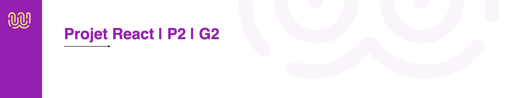

## Contexte
Nous sommes en formation à la Wild Code School dans le bootcamp "Développeur Fullstack".
Il s'agit du projet n°2 réalisé en groupe pour expérimenter un premier projet front-end en ReactJS.

## Team :

Nous sommmes une équipe de 4 développeurs/développeuses, il s'agit de notre première application ReactJS. Prêts pour la découvrir ? Attachez vos ceintures !

- Aleksandra Hamon
- Nadir Khouani
- Sylvain Moreau
- Arthur Vincent-Silvestrini

## Objectifs

Créer une plateforme web responsive pour une chaîne de restaurants dans toute la France avec un restaurant par ville (ex : Paris, Lyon, Bordeaux, etc.). L'utilisateur a la possibilité de sélectionner une ville pour récupérer sa commande en click'n collect ou choisir de se faire livrer.

## Maquette

Nous avons utilisé Figma pour créer la maquette de notre application et le parcours utilisateur :
https://www.figma.com/file/SOPeLvlICgZzXV1sDQ2zTY/King-Burger-Prototype-animation-design-(Community)?type=design&node-id=6-74&mode=design&t=ksW3kwyThlcXGgvt-0

### Nomenclature des branches :

- Branche principale `main` : code testé et fonctionnel | fusion à partir dev
- Branche dev `dev` fusion des fonctionnalités à partir des branches fonctionnelles
- Branche de fonctionnalité `Feature/US`
- Chaque merge vers `dev`, Créer une Pull-Request(PR) avec le formateur

## Méthode Agile

Méthode Agile (SCRUM) organisée en sprints hebdomaires et en daily journaliers. Le travail à faire est découpé en user stories.

#### Sprint d'une semaine

- daily de groupe tous les matins
- review tous les vendredis
- rétrospective de groupe un vendredi sur deux
- suivi du sprint planning pour préparer le sprint suivant

#### Rôles

- tout le monde est développeur mais, à chaque sprint, les rôles tournent :
- 1 Product Owner : gestion du travail à réaliser, préparation du prochain sprint, présentation du projet
- 1 Scrum Master : veille au bon respect du Scrum (daily, anime la rétrospective)
